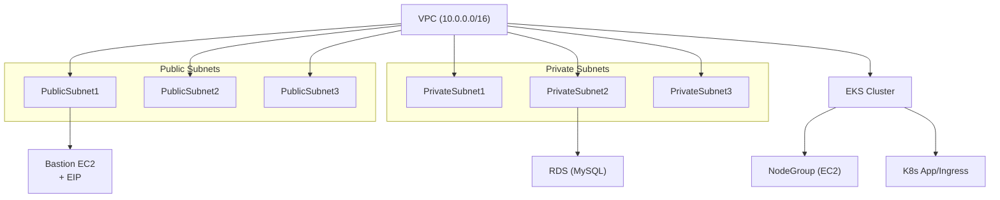

# service-infra

이 프로젝트는 Pulumi와 TypeScript를 활용하여 AWS 기반의 클라우드 인프라를 코드로 관리하는 IaC(Infrastructure as Code) 레포지토리입니다. 모든 리소스는 모듈화되어 있으며, 설정값(Pulumi config) 기반으로 유연하게 배포할 수 있습니다.

## 주요 구성 요소
- **VPC**: 퍼블릭/프라이빗 서브넷, IGW, NAT Gateway 등 네트워크 인프라 자동화
- **Bastion**: 퍼블릭 서브넷에 배치되는 SSH 접속용 EC2 인스턴스 및 EIP
- **RDS**: 프라이빗 서브넷에 배치되는 MySQL 데이터베이스 인스턴스
- **EKS**: AWS 관리형 Kubernetes 클러스터 및 노드그룹
- **(추후 진행 예정) ALB, App, Ingress, Route53**: 모듈화된 방식으로 추가 가능

## 특징
- Pulumi Config를 통한 환경별(개발/운영 등) 설정 분리
- 모든 리소스는 TypeScript 클래스로 모듈화되어 재사용 및 유지보수 용이
- AWS 리소스 간 의존성 및 Output/Input 타입 안전성 보장
- 최신 Pulumi/AWS 리소스 속성 및 베스트프랙티스 반영

## 인프라 구성 다이어그램 (Mermaid)

## 사용 방법
1. Pulumi CLI 및 AWS 자격증명 설정
2. `Pulumi.yaml`, `Pulumi.dev.yaml` 등 환경별 config 파일 작성
3. 의존 패키지 설치: `npm install`
4. 인프라 배포: `pulumi up`
5. 인프라 미리보기: `pulumi preview`
6. 인프라 삭제: `pulumi destroy`

## 폴더 구조
- `modules/` : 각 인프라 리소스별 Pulumi ComponentResource 모듈
- `index.ts` : 전체 인프라를 조합하는 엔트리포인트

---
